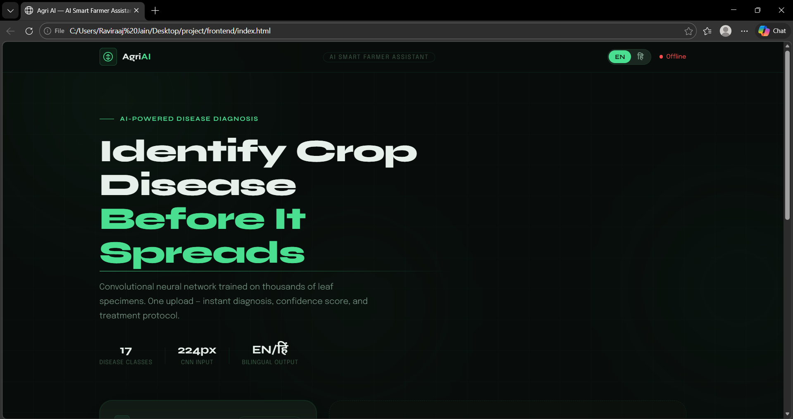
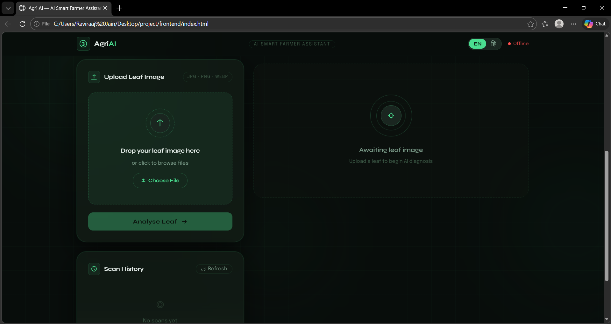
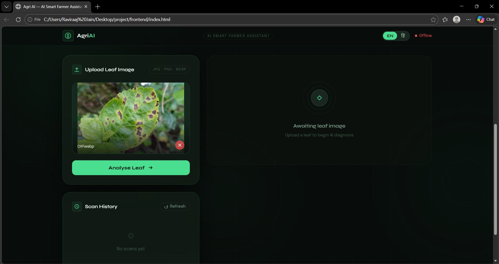
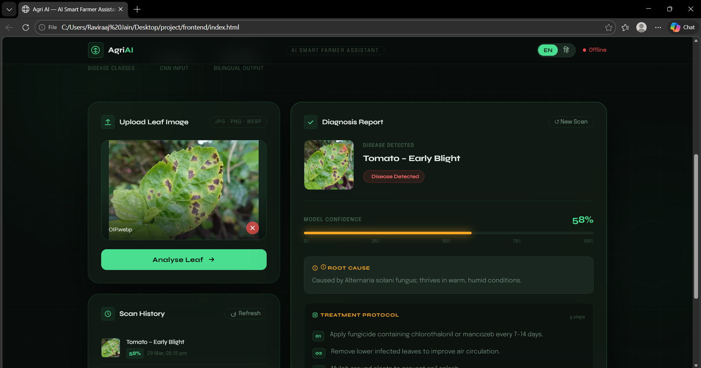
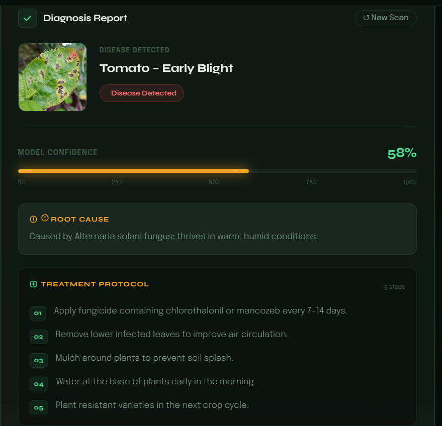
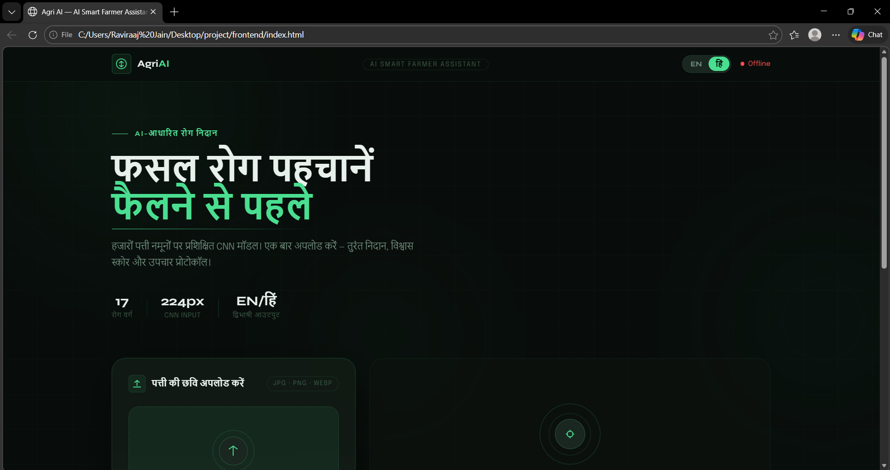
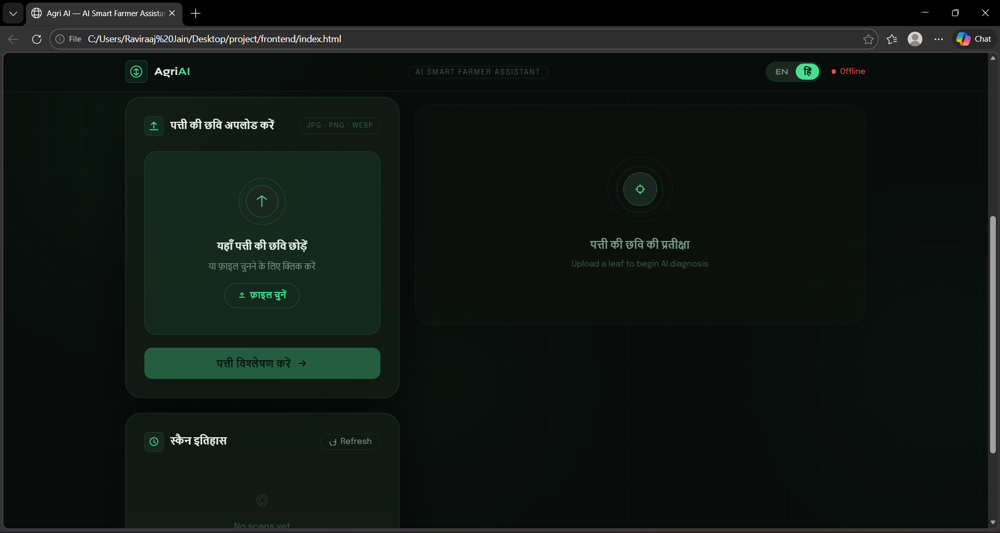
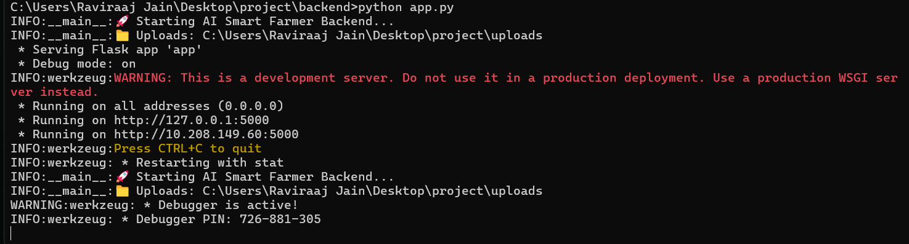

# 🌾 AgriAI – Smart Farmer Assistant

### 🤖 AI-Based Crop Disease Detection & Advisory System

---

## 📌 Project Overview

**AgriAI Smart Farmer Assistant** is a full-stack web application that uses Artificial Intelligence to help farmers detect crop diseases at an early stage.

The system allows users to upload an image of a plant leaf, which is then analyzed using a trained **Convolutional Neural Network (CNN)** model. Based on the analysis, the application predicts the disease, provides confidence scores, and suggests appropriate treatment methods.

This project demonstrates the practical use of **AI + Web Development + Database Systems** to solve real-world agricultural problems.

---

## 🎯 Problem Statement

Farmers often face difficulty in identifying crop diseases due to:

* Lack of technical knowledge
* Limited access to agricultural experts
* Delay in diagnosis leading to crop damage

As a result, crop productivity decreases and financial losses increase.

---

## 🎯 Objective

The main objectives of this project are:

* To detect crop diseases using AI
* To provide treatment suggestions
* To create an easy-to-use interface for farmers
* To store and track prediction history

---

## 🚀 Key Features

* 📸 Upload leaf images (JPG, PNG, WEBP)
* 🤖 AI-based disease detection using CNN
* 📊 Confidence score for predictions
* 💊 Cause and treatment suggestions
* 🌐 Multi-language support (English + Hindi)
* 🗂️ Prediction history stored in MySQL
* ⚡ Simulation mode (if AI model not available)
* 📱 Responsive and user-friendly interface

---

## 🛠️ Technologies Used

### 🔙 Backend

* Python (Flask)
* TensorFlow / Keras
* NumPy, PIL (Image Processing)

### 🌐 Frontend

* HTML
* CSS
* JavaScript (Fetch API)

### 🗄️ Database

* MySQL

---

## 📁 Project Structure

```
project/
│
├── backend/
│   ├── app.py              # Main Flask server
│   ├── utils.py            # Helper functions (image, DB, logic)
│   ├── generate_model.py   # AI model generator
│   ├── model.h5            # Trained model
│   ├── class_names.json    # Disease labels
│   └── requirements.txt    # Dependencies
│
├── frontend/
│   ├── index.html          # UI page
│   ├── style.css           # Styling
│   └── script.js           # Logic
│
├── database/
│   └── schema.sql          # MySQL tables
│
└── uploads/                # Stored images
```

---

## ⚙️ Installation & Setup Guide

### Step 1: Clone Repository

```bash
git clone https://github.com/Ravirajjain25bai11023/PROJECT_AgriAI-Smart_Farmer_Assistant.git
cd agriai-smart-farmer-assistant
```

---

### Step 2: Create Virtual Environment

```bash
python -m venv venv
venv\Scripts\activate
```

---

### Step 3: Install Dependencies

```bash
cd backend
pip install -r requirements.txt
```

---

### Step 4: Setup MySQL Database

```bash
mysql -u root -p < ../database/schema.sql
```

---

### Step 5: Configure Environment Variables

```bash
set DB_HOST=localhost
set DB_USER=root
set DB_PASSWORD=your_password
set DB_NAME=smart_farmer_db
```

---

### Step 6: Generate AI Model

```bash
python generate_model.py
```

---

### Step 7: Run Backend

```bash
python app.py
```

Server runs at:

```
http://127.0.0.1:5000/
```

---

### Step 8: Run Frontend

Option 1:
Open `frontend/index.html`

Option 2 (Recommended):

```bash
cd frontend
python -m http.server 8080
```

Then open:

```
http://localhost:8080
```

---

## 🧪 API Endpoints

| Endpoint          | Method | Description                     |
| ----------------- | ------ | ------------------------------- |
| `/`               | GET    | Server status                   |
| `/health`         | GET    | Health check                    |
| `/predict`        | POST   | Upload image and get prediction |
| `/history`        | GET    | Fetch past predictions          |
| `/uploads/<file>` | GET    | Access uploaded images          |

---

## 🔄 Working Process

1. User uploads a leaf image
2. Frontend sends request to backend
3. Backend processes image
4. AI model predicts disease
5. Result is returned and displayed
6. Data is stored in MySQL

---

## 📊 Sample Output

```json
{
  "success": true,
  "disease": "Tomato___Early_blight",
  "confidence": 89.23,
  "treatment": ["Use fungicide", "Remove infected leaves"]
}
```
## 📸 Working Screenshots

### 🏠 Home Interface



---

### 📤 Uploading Leaf Image




---

### 🤖 AI Prediction Result




---

### 🌐 Hindi Language Mode




---

### ⚙️ Backend Running (Flask Server)



---

## ⚠️ Challenges Faced

* Model loading delay
* Server crashes during prediction
* Database connection issues
* Image preprocessing errors

---

## ✅ Solutions Implemented

* Background model loading
* Simulation fallback system
* Error handling in backend
* Optimized image preprocessing

---

## 🌐 Future Scope

* Mobile application development
* Weather-based recommendations
* AI accuracy improvement
* Drone-based monitoring

---

## 🧠 Learning Outcomes

* Full-stack development
* AI model integration
* API development
* Database management
* Debugging real-world issues

---

## 🏆 Conclusion

This project successfully demonstrates how Artificial Intelligence can be used to solve real-world agricultural problems. It provides a simple yet powerful tool for farmers to detect crop diseases and take preventive measures, improving productivity and reducing losses.

---

## 👨‍💻 Author

**Raviraj Jain**
Entrepreneur | AI Developer | Guinness World Record Holder

---

## 📜 License

This project is created for educational and academic purposes.
